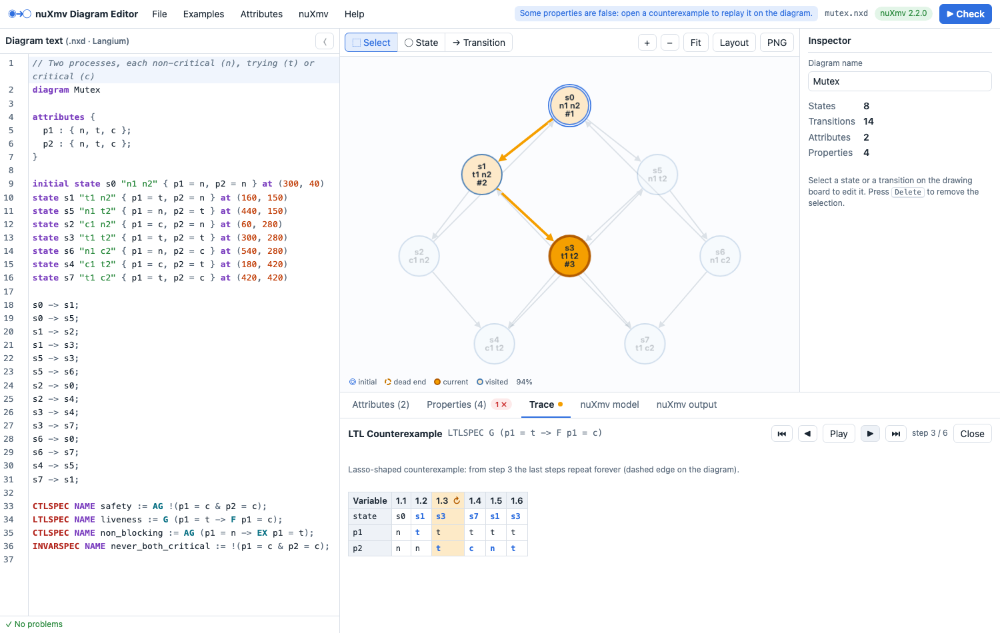

# ProvenFlow

Design, verify and run state machines for LLM agents. ProvenFlow is a browser-based diagram editor
for the [nuXmv](https://nuxmv.fbk.eu) model checker. Draw a directed finite state transition system,
or type it in a `.pflow` file, label its states with atoms, write LTL, CTL or invariant properties,
and check them with nuXmv. When a property is false, the counterexample is replayed step by step on
the diagram. From the same diagram it generates a Python runtime with monitors, live views in the
editor or Jupyter, trace conformance checks and probabilistic analysis. The `pflow` command-line tool
does the same from a terminal or CI.

It also works the other way round, from code to model: `pflow extract` builds verified models of an
existing (or AI-generated) code base. It extracts the code's state machines, resource lifecycles,
design-pattern contracts and layer dependencies, and checks them with nuXmv. It reports each bug
with the code path that shows it and a fix, and an optional LLM can propose patches that the tool
re-checks. See [Model-checking a code base](#model-checking-a-code-base).

The project was called `nuxmv-editor-js` until it was renamed, and diagrams used the `.nxd` extension.
The editor still opens `.nxd` files and saves them as `.pflow`.



This project re-implements **JungToNusmv**, the tool described in the MSc dissertation
*"A Java Graphical User Interface for the NuSMV Model Checker"* (B. El Kassaby, University of
Liverpool, 2007), with a current web stack. It also implements the dissertation's "future
developments" and removes the limitations listed in its evaluation chapter.

| 2007 (JungToNusmv)                                 | Now (ProvenFlow)                                              |
| -------------------------------------------------- | ------------------------------------------------------------------ |
| Java Swing GUI                                     | Angular 22 (standalone components, signals, zoneless)              |
| JUNG 1.7 graph editor                              | Cytoscape.js + cytoscape-edgehandles                               |
| `GraphMapping` / `NusmvFileWriter` (string arrays) | Langium 4 grammar (`.pflow`), typed diagram model, nuXmv generator   |
| `attributeData.txt`, edited by hand                | Attribute table (the planned Fig. 4.6 interface); the old file format can still be imported |
| `Runtime.exec` of NuSMV 2.4                        | Node.js/Express backend that runs nuXmv 2.x                        |
| Output copied into a text area                     | Verdicts parsed per property; counterexamples shown on the graph   |

## Features

- **Two synchronised views.** The text editor (CodeMirror, with Langium parsing and validation) and
  the drawing board (Cytoscape.js) edit the same model. Changes in one appear in the other.
- **Diagram editing.** Select/move, add-state and add-transition modes, self-loops, box selection,
  zoom (down to 2%) and pan, and PNG or SVG (vector) export. Initial states have a double border and
  dead-end states a dashed one. The panels around the diagram are resizable (drag the dividers;
  sizes are remembered) and the diagram can be maximized to the whole window.
- **Layouts.** Pick one from the toolbar; the positions are saved into the text:
  *Vertical* and *Horizontal* (layered, with dagre), *Spread* (tries dozens of layered, force-directed,
  circular and hub layouts, keeps the one with the fewest crossing transitions and fewest transitions
  running through other states, then improves it by swapping states), *Radial (hub)* (the most
  connected state in the centre and the flow around it, compact enough for one screen),
  *Force*, *Circle* and *Grid*.
- **Atoms and attributes.** Boolean, enumerated and integer-range attributes, edited in a
  state × attribute table. A value left unset lets nuXmv choose any value in that state.
- **Properties.** `LTLSPEC`, `CTLSPEC` and `INVARSPEC` (optionally named), plus `FAIRNESS` and
  `JUSTICE` constraints. Langium checks their syntax, rejects unknown names, and rejects CTL
  operators in LTL properties and the reverse.
- **Verification.** Three nuXmv engines: BDD (exact), bounded model checking, and IC3. Each result
  is matched to its property even though nuXmv reports them in its own order.
- **Counterexamples.** A lasso trace is shown both on the graph and as a table of variable values,
  with the steps and the start of the loop marked. You can step through it or play it.
- **Simulation.** Walk through the model by clicking successor states, or take random steps.
- **Logic help.** The Help menu explains every symbol of propositional, LTL and CTL logic (textbook
  notation, how to write it here, meaning), has a searchable glossary of model checking terms, and
  links to references, including the
  [nomenclature of logic symbols](https://en.wikipedia.org/wiki/List_of_logic_symbols).
- **Files.** Save and open `.pflow` files, export the `.smv` model, import the legacy
  `attributeData.txt` format, and load the built-in examples.
- **Guards and bounded data.** Variables (counters, flags) updated by transitions
  (`when retries < 2 do retries := retries + 1`), checked by nuXmv, simulated in the editor and
  enforced by the generated code.
- **From design to code.** A dependency-free Python runtime that only allows verified transitions
  and monitors the properties at run time; Jupyter notebooks with a live diagram; Hypothesis
  property-based tests; exports to XState, LangGraph, Burr and Temporal; NuRV full-LTL monitors.
- **Operations.** A two-way live link to running processes, OpenTelemetry spans, and trace
  conformance checking of recorded runs (JSON Lines or OpenTelemetry) against the model.
- **Probabilities.** Transition probabilities turn the diagram into a Markov chain: probability of
  reaching a state, expected steps and visits, and export to PRISM / Storm.
- **Import.** Existing LangGraph (JSON, Mermaid, Python source), CrewAI Flow, Mermaid and XState
  graphs become diagrams you can verify.

### Limitations of the original tool, now removed

| Dissertation, §5.2 / §5.3                                   | Here                                                          |
| ----------------------------------------------------------- | ------------------------------------------------------------- |
| Only the first state created can be initial                 | Any number of initial states: `init(state) := {s0, s2}`       |
| Dead-end states produce `state = s0 : {};` (parser error)   | Dead ends stutter (`state = s0 : s0;`) and a warning is shown |
| Attribute interface not connected                           | Attribute table plus per-state inspector                      |
| No open/save                                                | `.pflow` text format (it also keeps the layout)                 |
| LTL only                                                    | LTL, CTL, invariants, fairness                                |
| Tool tips show only the state name                          | Tool tips show all attribute values of the state              |
| No simulation, no graphical counterexample ("NusmvToJung")  | Both are implemented                                          |
| Must restart the tool to try another diagram                | New/Open/Examples at any time                                 |
| Hard-coded paths                                            | `NUXMV_PATH` environment variable                             |

## Designing and verifying agentic LLM systems

Execution frameworks such as XState, LangGraph or Temporal *run* an agent. This project is used
earlier, at design time: you describe the agent's control flow as a finite state machine and let
nuXmv explore **every** decision the LLM could make. You find infinite loops, bypassed guardrails,
steps taken out of order and unreachable states before writing or deploying the agent.

```
 1. Model the FSM ──▶ 2. Write properties ──▶ 3. Check with nuXmv ──▶ 4. Fix from counterexamples ──┐
        ▲                                                                                            │
        └────────────────────────────────────────── repeat until every property holds ◀─────────────┘
                                                               │
                                     5. Implement the verified FSM in your runtime and keep checking it in CI
```

### Step 1: Inventory the agent's states and decisions

List the control states of the agent: each XState state, LangGraph node or workflow step becomes a
`state`. Then list every way of leaving a state: LLM outputs (answer or tool call, pass or fail,
which specialist to route to), tool outcomes (success or error), and human events (approve or deny).
Each outcome becomes a transition.

### Step 2: Model LLM uncertainty as nondeterminism

Do not try to predict what the model will do. When a state has several outgoing transitions and no
guard, nuXmv treats the choice as free and checks all of them. That is the right abstraction for an
LLM: a property that holds proves the design is safe *whatever the model decides*. Transition labels
(`: "fails_eval"`) document the decision but do not restrict it.

### Step 3: Choose the atoms your properties need

Attributes label the states with the facts you want to reason about: the phase, whether a tool is
running, whether a human is being waited on, which agent is active. Two rules keep models faithful:

- **Bound every counter.** Either keep it in a bounded variable with guards and updates
  (`variables { retries : 0..3 := 0; }`, `test -> work when retries < 2 do retries := retries + 1`,
  see *Retry budget with data*), or unroll it into one state per retry (`critique0`, `critique1`,
  …). Without a bound the model contains an unbounded loop and termination fails (see below).
- **Give terminal states a self-loop** (`done -> done;`). nuXmv reasons about infinite paths; a state
  without a successor is reported as a dead end and made to stutter.

Example: a reflection loop with a budget of two refinements (`examples/agent-reflection-loop.pflow`,
also under *Examples → Agentic AI patterns*):

```
diagram AgentReflectionLoop

attributes {
  phase      : { drafting, critiquing, refining, approved, failed };
  loop_count : 0..3;   // the domain allows 3; the invariant proves no 3rd refinement
}

initial state drafting "draft" { phase = drafting, loop_count = 0 }
state critique0 "critique #1" { phase = critiquing, loop_count = 0 }
state refine1 "refine #1" { phase = refining, loop_count = 1 }
state critique1 "critique #2" { phase = critiquing, loop_count = 1 }
state refine2 "refine #2" { phase = refining, loop_count = 2 }
state critique2 "critique #3" { phase = critiquing, loop_count = 2 }
state approved "approved" { phase = approved }
state failed "max retries" { phase = failed, loop_count = 2 }

drafting -> critique0;
critique0 -> approved : "passes_eval";
critique0 -> refine1 : "fails_eval";
refine1 -> critique1;
critique1 -> approved : "passes_eval";
critique1 -> refine2 : "fails_eval";
refine2 -> critique2;
critique2 -> approved : "passes_eval";
critique2 -> failed : "fails_eval";
approved -> approved;
failed -> failed;
```

### Step 4: Write the properties the agent must satisfy

Properties refer to attribute values, or to the current state through the `state` variable
(`state = critique0`). Labels in quotes are not names. These templates cover most agent designs:

| Goal | Formula | Reads as |
| --- | --- | --- |
| Termination | `LTLSPEC F (phase = approved \| phase = failed)` | Every run ends in a terminal state, whatever the evaluator says |
| Goal always reached | `LTLSPEC F phase = approved` | Every run ends approved (false here: repeated rejections end in `failed`) |
| Bounded retries | `INVARSPEC phase = refining -> loop_count <= 2` | No state ever starts a third refinement |
| Progress possible | `CTLSPEC AG (phase = critiquing -> EX phase = approved)` | From every critique, some next step approves |
| Recovery | `CTLSPEC AG EF state = idle` | From every reachable state, a path back to `idle` exists |
| Guardrail | `CTLSPEC AG (!awaiting_human -> AX !tool_active)` | A tool can only start right after a human approval step |
| Step ordering | `LTLSPEC !(agent = meal_prep) U agent = recipe` | No meal preparation before a recipe has been written |
| Gate (past-time) | `LTLSPEC G (phase = deployed -> O phase = code_review)` | Nothing is deployed unless a code review happened before |
| Dead code | `CTLSPEC EF state = done` | `done` can be reached at all (false reveals an unreachable state) |
| No deadlock | `CTLSPEC AG EX TRUE` | Every reachable state has a successor |

`G` = always, `F` = eventually, `X` = next, `U` = until on the single run (LTL); `A`/`E` = on all /
some paths, combined as `AG`, `EF`, `AX`, … (CTL). The editor checks the syntax as you type and
rejects CTL operators inside an `LTLSPEC` (and the reverse).

### Step 5: Check, read the counterexample, fix the design

Press **Check**. Properties that hold get ✓. For each ✗, open **Counterexample**: the offending run
is highlighted on the diagram, step by step, with the loop of a lasso-shaped trace drawn dashed.
Typical fixes are adding a budget, a human checkpoint, a missing error transition or a terminal
state, or replacing an LLM router by a fixed sequence. The *Orchestration* and *Collaboration*
examples show that last fix and its effect on the verdicts.

The same model **without** the retry budget shows why Step 3 matters:

```
initial state drafting { phase = drafting }
state critiquing { phase = critiquing }
state refining { phase = refining }
state approved { phase = approved }
drafting -> critiquing;
critiquing -> approved : "passes_eval";
critiquing -> refining : "fails_eval";
refining -> critiquing;
approved -> approved;

LTLSPEC F phase = approved;            -- false: critiquing -> refining -> critiquing ... forever
CTLSPEC AG EF phase = approved;        -- true: approval is always *possible*, never guaranteed
```

Use **BDD** to prove properties, **BMC** to find short counterexamples fast in large models, and
**IC3** for invariants and LTL on models too large for BDDs. Use **Simulate** to walk the design
by hand when a trace needs more context.

### Step 6: Implement the verified FSM and keep it verified

Nothing is generated for you. Implement the verified design in your runtime with the same states
and transitions: in XState each `state` becomes a state node and each transition an `onDone`/`on`
target with its guard. Keep the `.pflow` file next to the code as its specification, and re-check it
in CI whenever the agent's flow changes:

```sh
NUXMV_PATH=/opt/nuXmv/bin/nuXmv npx pflow check agent.pflow   # exit 0: all hold, 3: a property is false, 1: error
```

For a CI gate, keep only must-hold properties in the checked file. Properties that are false by
design, such as `always_approved` above, make the exit code 3.

### What is and is not verified

nuXmv proves properties of the **model**: the control flow and every possible LLM decision. It does
not check what the LLM writes, nor that your implementation matches the diagram. Keep the two in
sync (one code state per diagram state is the simplest way), and keep the facts you care about,
such as approvals, counters and the active agent, as attributes so they can be checked.

## From verified diagram to running code

A verified design is only useful if the running system follows it. Everything below is generated
from the diagram, from the **Python** tab, the **File** menu or the `pflow` command line.

### Python runtime

`<name>_fsm.py` has no dependency. It contains `State` and `Event` enums, the labelling of every
state, the verified transition table, and the guards and updates of the transitions.

```python
import agentic_coding_loop_fsm as m

fsm = m.AgenticCodingLoopFSM()
fsm.send("USER_SUBMIT")                # or the label as written: fsm.send("user_submit")
fsm.allowed_events()                   # [PLAN_ACCEPTED, HUMAN_CLARIFIES]: offer them to the LLM
fsm.send("HUMAN_APPROVED")             # InvalidTransition: not allowed in state designing
```

- **Only verified moves.** `send(event)` follows a transition of the model whose guard holds and
  whose updates stay in range. `on_invalid=` decides what happens otherwise:
  - `"raise"` (the default) raises `InvalidTransition`;
  - `"return"` returns a falsy `Rejected`, whose `as_feedback()` text tells an LLM which steps are
    allowed;
  - `"escalate:<EVENT>"` fires a verified escalation event instead;
  - or pass your own handler.
- **Hooks.** `on_enter_<state>` / `on_exit_<state>` methods are where the LLM calls, tools and
  human approvals go. `restore(state, variables)` rebuilds a machine from serialised state.
- **Runtime monitors.** Invariants and `G(φ)` properties where φ only looks at the present and the
  past (`Y Z O H S T`) are checked after every step (`PropertyViolation` in strict mode). State
  guardrails in past time, e.g.
  `G (phase = deploying -> Y (phase = release_decision & actor = human))`, so that the same
  formula is both model checked and monitored. Future-time properties can use NuRV (below).
- **Observability.** `fsm.enable_tracing()` emits an OpenTelemetry span per transition and per
  rejected event (`fsm.state`, `fsm.event`, `fsm.value.*`). `fsm.record_to("run.jsonl")` writes
  every step to a JSON Lines file.

### Jupyter, live link and conformance

- **Notebook** (`.ipynb`, `pflow notebook diagram.pflow --verify`). It writes the module and shows
  the machine as a diagram with its current state. It adds a **live widget** (anywidget and
  Cytoscape.js) that follows every transition, a walk through the model, a rejected illegal event,
  the LLM tool-schema pattern and hooks, and replays of the nuXmv counterexamples.
- **Two-way live link.** With `fsm.link_editor("http://127.0.0.1:3000", channel="demo", commands=True)`,
  the editor's *Trace → Live from Python* view shows the running state, the next possible states
  and the rejected events. It can send events back: click a highlighted next state or an
  *▶ EVENT* button, e.g. a person approving a step. Commands still go through `send()`.
- **Trace conformance.** Use *Trace → Check a recorded run* or `pflow conform diagram.pflow run.jsonl`.
  It reads JSON Lines from `record_to()`, any log with a `state` field, or OpenTelemetry spans.
  Every step must follow an enabled transition, with the recorded event and values, and the
  monitored properties must hold. Problems are listed and the run is replayed on the diagram;
  the command exits with code 4 when the run deviates.

### Property-based tests, framework exports, full-LTL monitors

- **Property-based tests** (`test_<name>_fsm.py`, `pflow pytest [--verify]`). A Hypothesis
  `RuleBasedStateMachine` fires random allowed events. Each move must match the verified table,
  illegal events must be rejected without side effects, and monitors and variable domains must
  hold. The walk-through and the nuXmv counterexamples are replayed as scenarios. Point `FSM` at
  your subclass to test your hooks and glue code.
- **Framework exports** (Python tab → *Export to…*, `pflow export <framework>`):

  | Target | What you get |
  | --- | --- |
  | XState v5 | `setup().createMachine()` with guards (including update range checks) and `assign` actions |
  | LangGraph | a `StateGraph` with a node per state; each node `decide`s the event and the verified machine applies it |
  | Burr | an action per state and `when(event=...)` transitions |
  | Temporal | a durable workflow: decisions are activities, human states wait for a signal, only verified moves are taken |

  The Python targets import the generated `<name>_fsm.py`, so the verified table stays the single
  source of truth. Each is tested by running it in its framework.
- **NuRV monitors** (Python tab → *NuRV monitors*, `pflow nurv diagram.pflow -o dir`, needs
  `NURV_PATH` and a C compiler). [NuRV](https://es-static.fbk.eu/tools/nurv/), built on nuXmv,
  generates monitors for the future-time LTL properties. They monitor *under the model's
  assumptions*: a verdict becomes true or false as soon as the observed run decides the property
  for every continuation the model allows. Attach one with `fsm.add_nurv_monitor(module)`.
  NuRV is free for academic use and licensed separately.

The test suite checks the generated code against nuXmv in both directions. Random walks along the
verified transitions never trip a monitor of a property nuXmv proved. On a model with a planted
defect, the monitors report the same properties nuXmv refutes. The editor's simulator, the
conformance checker and the Python runtime also agree step by step on models with guards and data.

## Model-checking a code base

`pflow extract` turns a TypeScript/JavaScript, Angular or Python project into models and checks
them with nuXmv:

- **State machines:** from every field typed as a finite set of values (a string-literal union, an
  enum, `signal<Phase>`, a Python `Enum`/`Literal`). It finds:
  - values that are declared but never set (and the dead branches testing them);
  - states the machine can never leave or settle from;
  - `switch`/`match` statements missing cases;
  - writes after an `await` that rely on a check made before it.
- **Resource lifecycles:** for timers, global listeners, EventSources, observers, processes, temp
  dirs, files and locks. It finds a resource acquired twice, one never released on dispose, and a
  release that is skipped on errors.
- **Design patterns:** singleton, observer, builder, State, strategy, adapter/decorator, command,
  factory and facade are recognised. Each is checked against its contract: never two singletons,
  an observer can unsubscribe, no unconfigured build, every state reachable, and so on.
- **Architecture and paradigm:** layers and what each may import (cycles are proved by nuXmv),
  deep imports that bypass a facade, and file cycles. For the declared style of each layer
  (functional or object-oriented): mutated arguments, hidden global state, god classes, deep
  inheritance.

In the editor, choose **File → Import code base…** and pick a folder on your computer (the sources
are uploaded to the ProvenFlow server) or type a folder path. The path option is for when the
server runs on your machine: the folder is then read in place, with its `node_modules`. Findings,
models, patterns and paradigm profiles show in the dialog. **Open model** loads a model into the
editor and checks it, so its counterexample is one click away. From a terminal:

```sh
NUXMV_PATH=/path/to/nuXmv npx pflow extract path/to/project          # report in path/to/project/.provenflow/extract/
npx pflow extract . --fail-on warning                                # CI gate (exit 5), report.sarif for code scanning
npx pflow extract . --llm anthropic:claude-sonnet-5 --llm-fixes 5    # or openai:<model>, ollama:<model>
```

Each finding gives:
- the location;
- the counterexample as code events, e.g. `Poller.start -> held, Poller.start -> leaked`;
- a fix.

The models are `.pflow` files: open them in the editor to see and replay them. An LLM, if you
enable one, resolves computed values, suggests requirements and proposes patches. Its answers are
only kept after deterministic checks: a cited write must exist, a property must parse and is
decided by nuXmv, and a patch must pass a full re-run of the checks. Declare what your code
promises (layers, styles, patterns, machine properties, accepted exceptions) in
`provenflow.config.json`.

**Try it on ProvenFlow itself.** The repository has its own `provenflow.config.json`, and CI runs
this check. In the editor, use File → Import code base… with the path of your clone. From a
terminal:

```sh
npm install && npm run build
NUXMV_PATH=/path/to/nuXmv npm run check:code     # pflow extract . --fail-on warning
open .provenflow/extract/report.md               # models in .provenflow/extract/models/*.pflow
```

The full guide is in [docs/code-model-checking.md](docs/code-model-checking.md). It covers:
- every rule and how it is checked;
- how the extraction works, and what a proof or a counterexample means;
- the config reference and the LLM trust model;
- what the first run on ProvenFlow found, and what was changed.

## Probabilistic analysis

Give transitions a probability (`prob 0.3` in the text, or in the inspector) and the
**Properties** tab's *Probabilistic analysis* treats the diagram as a discrete-time Markov chain
over configurations (state and variables):
- the probability of eventually reaching a condition, or reaching it within *k* steps;
- the expected number of steps to reach it;
- the expected number of visits to another condition on the way, e.g. escalations before a merge.

Transitions without a probability share what is left, and distributions are normalised. *Export
PRISM model* writes the same chain for [PRISM](https://www.prismmodelchecker.org/) or
[Storm](https://www.stormchecker.org/), with labels, rewards and a properties file; the built-in
values match PRISM 4.10.1. Expect the two kinds of analysis to disagree in one systematic way.
nuXmv says a run *can* avoid a state forever; the Markov chain may still reach it with
probability 1.

## Importing existing agents

*File → Import agent graph* (`pflow import`) turns an existing graph into a diagram, which you then
annotate with atoms and properties and verify. It reads:
- LangGraph's `get_graph().to_json()` and `draw_mermaid()`;
- Mermaid `flowchart` and `stateDiagram`;
- XState machine configs;
- best effort, by pattern matching: LangGraph and CrewAI Flow Python source.

`START` and `END` become initial and final states, and conditional edges become nondeterministic
choices, so nuXmv checks every branch a router could take.

For how this compares with other tools, see [docs/state-of-the-art.md](docs/state-of-the-art.md).

## Architecture

```
packages/
├── language/   @provenflow/language  (runs in the browser and in Node)
│   ├── src/state-diagram.langium       grammar of the .pflow language
│   ├── src/state-diagram-validator.ts  types, names, dead ends, LTL/CTL checks
│   ├── src/model.ts                    DiagramModel: the shared data structure
│   ├── src/serializer.ts               DiagramModel -> .pflow text
│   ├── src/smv-generator.ts            DiagramModel -> nuXmv model
│   ├── src/nuxmv-output.ts             nuXmv output -> verdicts + traces
│   ├── src/semantics.ts                executable semantics: guards, updates, past-time monitors
│   ├── src/python-generator.ts         DiagramModel -> Python runtime + monitors
│   ├── src/pytest-generator.ts         DiagramModel -> Hypothesis property-based tests
│   ├── src/framework-export.ts         DiagramModel -> XState / LangGraph / Burr / Temporal
│   ├── src/importers.ts                LangGraph / CrewAI / Mermaid / XState -> DiagramModel
│   ├── src/conformance.ts              recorded runs (JSONL / OpenTelemetry) vs the model
│   ├── src/probabilistic.ts            Markov chain analysis, PRISM export
│   ├── src/nurv.ts                     NuRV monitor synthesis plan
│   ├── src/notebook-generator.ts       DiagramModel -> Jupyter notebook
│   └── src/legacy-attributes.ts        import of JungToNusmv attributeData.txt
├── extract/    @provenflow/extract   code base -> verified models (pflow extract)
│   ├── src/typescript-*.ts             TypeScript checker front end (+ Angular templates)
│   ├── src/python_facts.py             Python front end (ast), same facts as JSON
│   ├── src/machines.ts                 state machines of fields with finite types
│   ├── src/lifecycles.ts               resource typestate models
│   ├── src/patterns.ts                 design-pattern recognition and contract models
│   ├── src/architecture.ts  paradigm.ts  layer graph model, cycles, facades; style rules
│   ├── src/verify.ts                   nuXmv / explicit-state checks, counterexamples -> code
│   ├── src/llm.ts                      optional LLM (Anthropic, OpenAI-compatible, Ollama), verified
│   └── src/report.ts                   report.md / .json / .sarif, .pflow models, scenarios
├── server/     @provenflow/server    Node.js + Express
│   ├── src/nuxmv-runner.ts             spawns nuXmv (BDD / BMC / IC3), timeouts
│   ├── src/nurv-runner.ts              runs NuRV, fixes and returns the generated monitors
│   ├── src/app.ts                      REST API, live channel (SSE), serves the built UI
│   └── src/cli.ts                      the `pflow` command-line tool
└── app/        @provenflow/app       Angular UI
    └── src/app/
        ├── diagram-store.ts            signals store keeping text and diagram in sync
        ├── text-editor/                CodeMirror + Langium diagnostics
        ├── diagram-canvas/             Cytoscape.js editor, trace highlighting
        ├── attribute-table/  inspector/  properties-panel/  trace-panel/  output-panel/
        └── nuxmv-api.ts                calls the backend
```

```
 .pflow text ──Langium parse/validate──▶ DiagramModel ◀──edits── Cytoscape diagram
     ▲                                     │
     └────────────── serialize ────────────┤
                                           ▼
                                  nuXmv model (.smv) ──POST /api/verify──▶ Node ──spawn──▶ nuXmv
                                                                              │
                  trace on diagram ◀── verdicts + counterexamples ◀── parse ◀─┘
```

## Getting started

### 1. Install nuXmv

nuXmv is not included in this repository. Its license is separate from this project's (free for
non-commercial and academic use). Download it from <https://nuxmv.fbk.eu/download.html>, extract it,
and point `NUXMV_PATH` at the binary:

```sh
export NUXMV_PATH=/path/to/nuXmv-2.2.0-linux64/bin/nuXmv
```

<details>
<summary>macOS: <code>Library not loaded: /opt/local/lib/libxml2.16.dylib</code></summary>

The macOS build is linked against MacPorts libraries. Either install them with MacPorts
(`sudo port install libxml2 gmp libedit`), or use the Homebrew versions through a small wrapper
script:

```sh
brew install libxml2 gmp libedit
cat > ~/bin/nuxmv <<EOF
#!/bin/sh
DYLD_FALLBACK_LIBRARY_PATH="$(brew --prefix libxml2)/lib:$(brew --prefix gmp)/lib:$(brew --prefix libedit)/lib" \\
  exec /path/to/nuXmv-2.2.0-macos64/usr/local/bin/nuXmv "\$@"
EOF
chmod +x ~/bin/nuxmv
export NUXMV_PATH=~/bin/nuxmv
```
</details>

### 2. Build and run

Requires Node.js 20.19 or later.

```sh
npm install
npm run build
NUXMV_PATH=/path/to/nuXmv npm start      # http://127.0.0.1:3000
```

For development with live reload (Angular on :4200, API proxied to :3000):

```sh
NUXMV_PATH=/path/to/nuXmv npm run dev    # http://localhost:4200
```

Everything except running nuXmv (editing, validation, model generation, simulation) happens in the
browser.

| Variable                 | Default                       | Meaning                                       |
| ------------------------ | ----------------------------- | --------------------------------------------- |
| `NUXMV_PATH`             | `nuXmv` (looked up on `PATH`) | nuXmv executable                              |
| `PORT` / `HOST`          | `3000` / `127.0.0.1`          | Listening address (loopback by default)       |
| `NUXMV_TIMEOUT_MS`       | `60000`                       | nuXmv is killed after this time               |
| `NUXMV_MAX_OUTPUT_BYTES` | `5000000`                     | Output kept per run                           |
| `STATIC_DIR`             | `packages/app/dist/app/browser` | Built UI served on `/`                      |

## The `.pflow` language

```
// Resource monitor (Huth & Ryan, Logic in Computer Science, ch. 3)
diagram ResourceMonitor

attributes {
  status  : { ready, busy };     // enumeration
  request : boolean;
  level   : 0..3;                // integer range
}

initial state s0 "idle" { status = ready, request = TRUE } at (120, 100)
state s1 { status = busy, request = TRUE }       // `at` (the layout) is optional
state s2 { status = ready }                       // request unset: any value

s0 -> s1 : "request";            // optional transition label (the event name in generated code)
s1 -> s0;
s2 -> s0;

FAIRNESS request;
LTLSPEC G (request -> F status = ready);
CTLSPEC NAME can_reset := AG EF state = s0;
INVARSPEC level <= 3;
```

- Expressions use nuXmv syntax: `! & | xor xnor -> <->`, `= != < > <= >=`, `+ - * / mod`, LTL
  `G F X U V`, past-time LTL `Y Z O H S T`, CTL `AG AF AX EG EF EX A[p U q] E[p U q]`. The variable `state` holds the name of
  the current state.
- Data variables are declared with an initial value and changed by transitions, which can also
  have a guard and a probability:

  ```
  variables { retries : 0..3 := 0; approved : boolean := FALSE; }
  test -> work : "tests_failed" when retries < 2 do retries := retries + 1 prob 0.3;
  review -> done : "approve" do approved := TRUE;
  ```

  A transition is enabled when its guard holds and its updates stay in range; when nothing is
  enabled the state stutters. Diagrams with data are encoded with a `TRANS` relation.
- `--`, `//` and `/* */` comments are accepted.
- Keywords and temporal operators (`state`, `at`, `G`, `F`, `X`, `U`, `V`, `O`, `H`, `A`, `E`, …) are
  reserved and cannot be used as names.

The generator writes the "sequential style" model of the dissertation (§2.2.2): a `state`
variable, one `init`, a `next(state)` case per state, and one invariant assignment per attribute:

```
MODULE main
VAR
    state : {s0, s1, s2, s3};
    status : {ready, busy};
    request : boolean;
ASSIGN
    init(state) := s0;
    next(state) := case
        state = s0 : {s1, s3};
        state = s1 : {s1, s3};
        ...
        TRUE : state;
    esac;
    status := case
        state = s0 : ready;
        state = s1 : busy;
        ...
    esac;
LTLSPEC
    G (request -> F status = ready);
```

## Command line

```sh
npx pflow generate examples/mutex.pflow -o mutex.smv
NUXMV_PATH=/path/to/nuXmv npx pflow check examples/mutex.pflow --engine bdd
#   true        CTLSPEC safety := AG !(p1 = c & p2 = c)
#   false       LTLSPEC liveness := G (p1 = t -> F p1 = c)
#                 1.1: state = s0
#                 1.2: state = s1
#                 1.3: state = s3  <- loop starts
#   ...
```

| Command | What it does |
| --- | --- |
| `pflow generate <d.pflow> [-o m.smv]` | write the nuXmv model |
| `pflow check <d.pflow> [--engine bdd\|bmc\|ic3] [--bound N]` | verify the properties (exit 3 if one is false) |
| `pflow python <d.pflow> [-o m.py]` | Python implementation with runtime monitors |
| `pflow notebook <d.pflow> [--verify]` | Jupyter notebook (with verdicts and counterexamples when `--verify`) |
| `pflow pytest <d.pflow> [--verify]` | Hypothesis property-based tests |
| `pflow export <xstate\|langgraph\|burr\|temporal> <d.pflow>` | framework code |
| `pflow import <graph> [-o d.pflow]` | LangGraph / CrewAI / Mermaid / XState graph to a diagram |
| `pflow conform <d.pflow> <run.jsonl\|otel.json>` | check a recorded run (exit 4 if it deviates) |
| `pflow prob <d.pflow> --reach EXPR [--within K] [--steps EXPR] [--visits EXPR --until EXPR]` | probabilistic analysis |
| `pflow prism <d.pflow> [-o m.pm]` | PRISM / Storm model and properties |
| `pflow nurv <d.pflow> [-o dir]` | NuRV full-LTL monitors (`NURV_PATH`) |
| `pflow extract <dir> [-o out] [--config f] [--fail-on error\|warning\|none] [--llm p:model] [--llm-fixes N]` | verified models of a code base, findings with fixes (exit 5 on findings) |

## REST API

| Method | Path          | Body                                                                                            |
| ------ | ------------- | ----------------------------------------------------------------------------------------------- |
| GET    | `/api/health` | returns nuXmv availability and version                                                          |
| POST   | `/api/verify` | `{ "model": "<smv>" }` or `{ "diagram": "<pflow text>" }`, plus `engine` (`bdd`/`bmc`/`ic3`) and `bound` |
| POST   | `/api/live/<channel>` | a state update `{ state, event?, step?, values?, violations? }` from a running machine |
| GET    | `/api/live/<channel>/stream` | Server-Sent Events stream of those updates (the last one first) |
| POST   | `/api/live/<channel>/command` | `{ event }` sent to the running machine (two-way link) |
| GET    | `/api/live/<channel>/commands` | Server-Sent Events stream of commands, read by `link_editor(..., commands=True)` |
| POST   | `/api/nurv` | `{ diagram }`: NuRV monitor sources and build commands (needs `NURV_PATH`) |
| POST   | `/api/extract` | `{ path }` (a folder of the server machine, when the server is bound to localhost; `PROVENFLOW_EXTRACT_PATHS=0` disables it) or `{ files: { "src/a.ts": "…" } }` (uploaded sources), plus optional `config`: findings, models with their `.pflow` text, patterns, paradigm and the Markdown report |

The response contains the raw `stdout`/`stderr` and the parsed `results` (property, verdict, trace),
`errors` and `warnings`.

## Tests

```sh
npm test            # language, extract, server and UI unit tests
npm run check:code  # ProvenFlow model-checks its own code base (pflow extract . --fail-on warning)
```

The extract tests run on `packages/extract/test/fixtures/shop`, a small TypeScript and Python
project with one seeded bug of each kind. With `NUXMV_PATH` set they also check the nuXmv
counterexamples.

Optional tools turn on more tests, and CI installs the Python packages:
- `NUXMV_PATH`: every example is run on real nuXmv with all engines.
- `NURV_PATH` plus a C compiler: NuRV monitors are generated and run.
- `PRISM_PATH`: the Markov chain values are compared with PRISM.
- Python with `opentelemetry-sdk`, `hypothesis`, `pytest`, `langgraph`, `burr` and `temporalio`:
  the generated code runs with tracing, property-based tests and each framework export.

## Examples

**Classic models** (`examples/`): the resource monitor (§2.2.2), the Appendix A walkthrough with
its `attributeData.txt`, the [HR04] mutual exclusion model (its liveness property fails), and the
Clarke–Grumberg–Peled microwave oven (its property holds only under fairness).

**Agentic AI patterns**, modelled after the XState machines of
[adamterlson/AgenticStateMachines](https://github.com/adamterlson/AgenticStateMachines). The
LLM's decisions (call a tool or answer, approve or deny, which agent runs next) become
nondeterministic transitions, so nuXmv checks every possible choice the model could make:

| Example                          | What model checking shows                                                            |
| -------------------------------- | ------------------------------------------------------------------------------------ |
| Writer with tool use             | Tool results always return to the writer, but the LLM can call the tool forever       |
| Reflection (bounded)             | With the loop counter unrolled, termination is proved                                |
| Retry budget with data (guards) | The same kind of budget as a bounded variable with guards; transitions carry probabilities |
| Reflection loop with retry budget | Always terminates, but can end in `failed` after two rejected refinements             |
| Human-in-the-loop tool approval  | No tool runs without approval; repeated denials can prevent completion               |
| Orchestration (LLM router)       | The router can prepare the meal before any recipe exists (counterexample)            |
| Agentic coding loop with reviews and release | Security and quality agents review before the human merges; only the tested, staged, merged change is deployed, and only on the human's release decision |
| Educational agents               | Students only get instructor-approved content; two failures always escalate to the instructor, who can still block every plan |
| Collaboration (fixed pipeline)   | The same agents in a fixed sequence satisfy the ordering and termination properties  |
| Chat agent                       | The machine's `done` state is unreachable: dead code in the original definition      |
| Agent generation with testing    | Steps happen in order, but a failing test can retry forever                          |

Every example lists the verdict nuXmv should return for each property, and the server tests check
them against the real tool.

## License

MIT, see [LICENSE](LICENSE). nuXmv is a separate product with its own license.
